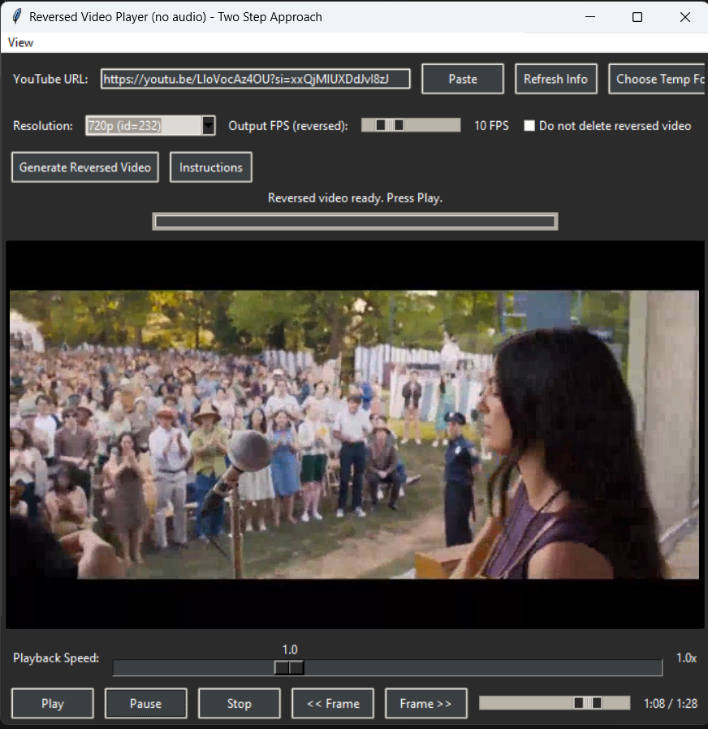

# YouTube Reverse Player



> **"Did you ever watch teardown or how-to-disassemble tutorial videos,  
> but then had trouble putting it all back together?**  
> Here's your solution: easily reverse any YouTube video so you can watch it in reverse.  
> Learn exactly how to reassemble that gadget you just tore apart!"

This script downloads a YouTube video, reverses it (in a two-step process), and then plays it back in a simple GUI.  
You can quickly scrub through frames, play/pause, adjust playback speed, and jump frame-by-frame. The encoding process is optimized for speed rather than output video quality to provide quick results.

## Features

- **Download** any YouTube video (up to 1024p, by default)
- **Two-step Reversal** using FFmpeg:
  1. Reverse + reset timestamps  
  2. Re-encode at your chosen FPS  
- **GUI Controls** for playback:
  - Play / Pause / Stop  
  - Scrub timeline  
  - Frame-by-frame navigation  
  - Playback speed slider  
- **Optional**: Choose a custom temporary folder to store intermediate files  
- **Minimal** dependencies: Python, `yt-dlp`, `ffmpeg`, and VLC (for `libvlc`)

## Requirements

1. **Python 3.9+**  
   - Download from [python.org](https://www.python.org/downloads/) if needed  
   - Make sure to check "Add Python to PATH" when installing
2. **FFmpeg** (must be available as `ffmpeg` in your `PATH`, or place `ffmpeg.exe` in the same folder)  
   - You can download from [ffmpeg.org](https://ffmpeg.org/download.html)
3. **VLC** (installed normally, or manually provide `libvlc.dll` and plugins)  
   - Download from [videolan.org/vlc](https://www.videolan.org/vlc/)  
   - Typically installing with default options ensures `python-vlc` can find `libvlc.dll`
4. Tested primarily on Windows, but should work on macOS or Linux if the above requirements are met

## Installation / Getting Started

1. **Clone** this repository:
   ```bash
   https://github.com/roundyyy/YouTube-Reverse-Player.git
   ```
   Or download the ZIP and extract it.

2. **(Optional)** If you haven't already:
   - Install Python 3.9+
   - Install VLC
   - Install FFmpeg

3. **Double-click start.bat** on Windows:
   - This will:
     - Check if Python is installed
     - Install the Python dependencies (yt-dlp, python-vlc) via requirements.txt
     - Launch the GUI tool

That's it! If everything is installed, you should see the tool's GUI window.

## Usage

1. **YouTube URL**: Paste the link of the video you want to reverse (up to 1024p)
2. **Refresh Info**: Click Refresh Info to see the available resolutions
3. **Choose Resolution**: Select the resolution you want to download
4. **Output FPS**: Use the slider to choose the FPS for the reversed video
5. **Generate**: Click Generate Reversed Video
   - The tool will:
     - Download the chosen format of the video via yt-dlp
     - Reverse it in two steps using FFmpeg
     - Load it into the built-in VLC player
6. **Controls**:
   - Play / Pause / Stop: Standard controls to watch your reversed video
   - Frame-by-Frame: Use << Frame or Frame >> to jump backwards or forwards by one frame at a time
   - Playback Speed: Adjust the slider (0.1x up to 3x)
   - Keeping the reversed video: Check or uncheck "Do not delete reversed video" if you want the final reversed .mp4 file to remain when you close the app

## Detailed Explanation of Functions

### `load_config()` and `save_config(cfg)`
- Handles loading and saving user preferences (e.g., chosen temp folder, whether to keep reversed videos) in a local settings.json

### `get_available_formats(url)`
- Uses yt_dlp to fetch the video's available formats up to 1024p
- Returns a list of (height, format_id)

### `download_video(url, format_id, output_path, progress_callback)`
- Downloads the specified format to output_path
- Uses a progress_callback to report download percentage in real time

### `two_step_reverse_and_fps(in_path, out_path, user_fps, progress_callback)`
- Calls FFmpeg in two steps:
  1. Reverse and reset timestamps
  2. Encode to desired user_fps
- No audio is retained, as this script is primarily for reversing the visuals

### `VLCPlayerApp` (the main GUI class)
- Manages the Tkinter UI, VLC playback, timeline updates, and user interactions:
  - `on_refresh_info()` → Fetch available resolutions
  - `on_generate()` → Download & reverse video
  - `on_play()`, `on_pause()`, `on_stop()` → Playback controls
  - `on_prev_frame()`, `on_next_frame()` → Frame-by-frame stepping
  - `on_speed_change()` → Changes playback rate in real time
  - `on_close()` → Cleanup (temp folders, config save, etc.)

## Known Limitations

- No audio is retained in the reversed output
- High resolutions above 1024p are skipped by default (you can modify the code if you want higher resolutions)
- VLC may occasionally have trouble with certain exotic codecs or unrecognized container formats. Try a different resolution if that happens
- The FFmpeg encoding parameters are optimized for processing speed rather than output quality - if you need higher quality output, you may want to modify the encoding parameters in the `two_step_reverse_and_fps` function

## FAQ

**Q: Do I need VLC in my PATH environment variable?**  
A: Typically, no. If you installed VLC with the default settings, python-vlc should find it automatically. If you installed VLC in a non-standard location, you may need to copy libvlc.dll and plugins/ into the same folder as this script or reinstall VLC to its default location.

**Q: What if ffmpeg is not found?**  
A: Install FFmpeg or copy its executable into the project folder. If on Windows, ensure ffmpeg.exe is in the same folder or in your PATH. Tutorial : [tutorial](https://phoenixnap.com/kb/ffmpeg-windows)

**Q: Can I keep the reversed .mp4 file permanently?**  
A: Yes—check the box "Do not delete reversed video" in the app. Otherwise, it's deleted when you close the program.

**Q: What if I get an error about libvlc or python-vlc?**  
A: Make sure you installed the normal VLC player. Reinstall or place libvlc.dll in this folder.

## License

This project is distributed under the MIT License. See LICENSE for details.

Happy reversing! If you run into issues, please open an issue or feel free to submit a PR.
